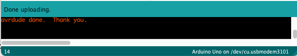

# dataLogger

## Introduction
This repository contains a series of coding examples which support developing a simple data logger. The examples are:
1. **test** - demonstrate all aspects of the programming environment are working
2. **analogRead** - demonstrate how to capture and display analog values
3. **analogSave** - demonstrate once the values have been captured, store in EEPROM memory to retain on power off
4. **eepromRead** - re-display the values which have been stored in EEPROM
5. **dataLogger** - simple data logger which resolves *analogSave* flaw
6. **dataLogger_wANdisplay** - enhancement of *dataLogger*, adding an alphanumeric display to the Uno to display status and captured data

## Installation (If new to GitHub)
1. Click on down arrow in the green "*<> Code*" button in the upper right corner of this page.
2. Make sure you are on the tab "*Local*".
3. Click on "**Download ZIP**"
4. Once downloaded, double-click (macOS) (or right-click and select [Extract All](https://www.pcworld.com/article/394871/how-to-unzip-files-in-windows-10.html) (Windows)) to uncompress the ZIP file into a folder.
5. Move the folder where you want to keep it...*Documents*, *MyDocuments* etc
6. Open the Arduino program, the original version, **not the new 2.0 IDE**.
7. In Arduino, click on Open and navigate to *dataLogger -> Arduino -> Uno -> test*. Yes, this is the same code as the *blink* example in this Examples. It is great for testing your PC, Arduino, USB cable and Uno are all working together.
8. In Arduino, go to *Sketch -> Upload* to compile and upload *test* to the Uno. If everything is working correctly, you will see "*Done uploading*" in a green bar at the bottom of the Arduino window, an "avrdude done. Thank you." below the "*Done...*" message and your Uno will be blinking slowly.

9. Follow the directions in the *Sketches 1. test* below to confirm you are able to change the blink rate.

## Shortcuts

**1. Compile** - The *checkmark* icon in the upper lefthand corner of the Arduino window is useful for checking if your sketch will compile. If you are attempting to solve a series of compilation errors, its useful to fix the first error found then *compile* again, before attempting to *upload*. Repeating this "*fix first found error -> Compile*" until all errors are fixed is a useful tool, as compared to *upload*, which might upload your code, even though it still has errors. You may also use the keys *Cmd-R* (macOS) or *Ctrl-R* (Windows) to perform the *compile* command.
**2. Upload** - The arrow pointing to the right beside the *Compile* checkmark can be used to upload the code or you may use the keys *Cmd-U* (macOS) or *Ctrl-U* (Windows) to perform the *Upload* command. If a compilation error occurs when using the upload command, fix the error and re-compile or re-upload. Don't attempt to run a program which hasn't compiled successfully.
**3. Save** - The down arrow in the top of the Arduino window will save the file. This is important as you will want to save often so you don't lose your work. You may also use the keys *Cmd-S* (macOS) or *Ctrl-S* (Windows) to perform the *Save* command.
**4. Serial Monitor** - The magnifying glass icon in the upper right-hand corner of the Arduino window will open the serial monitor. This will allow you to view messages sent from the Arduino i.e. *Serial.print()*, as well as allow you to send text to the Uno i.e. *Serial.read()*, when programmed properly. Opening the Serial Monitor will also reset the Uno.

**Reset** - There is a button right beside the USB connector on the [Uno](./docs/ArduinoUno_R3_Pinouts.png). If you wish to rerun your program with no changes to the code, simply press the *reset* button and the code will be rerun from the beginning. This is useful in situations where you might be running *analogRead*, for example, and you want to see new data.
## Sketches:
### 1. test
The ubiquitous "Hello World" program for the Uno to demonstrate the PC, Arduino IDE, USB cable, Uno are all connected and working properly. 

Do **NOT** depend on a blinking Uno to indicate that everything is working.  Change the delay value in the two *delay()* commands to ensure your changes are being written to the Uno. For example, the current value is *1000* which equates to *1 change per second*, change the values to *500* (*twice per second*) or even better change the value to *100* (*ten times per second*) as the blink rate change needs to be obvious.

Use this program as needed, to determine if everything is working properly. It is a great way to debug your *total system*, when *something just isn't working right*. The blink concept is also a great way to demonstrate a program's state, an example of which, you will see in a later program.

### 2. analogRead
Reads an analog pin (*A0*) and displays the values using the serial port. Open the serial monitor via *Tools -> Serial Monitor* to view the values. 

To test, attach a potentiometer with the following wiring:

* left pin to GND
* center pin to the analog pin *A0*
* right pin to 5V

Rotate the potentiometer and watch the values change on the screen. If the values, don't change, check your connections. 

### 3. analogSave
Builds on *analogRead* by adding the ability to save the values to the Uno memory called EEPROM. This memory retains its contents when power is removed, which means it is great for saving data read or captured. It allows you to power the Uno, capture the data then remove power from the Uno with the data retained. *analogSave* will fill all of the EEPROM memory (1kB or 1024 bytes on the Uno) with data and will stop once the memory is full.

The format of the data saved is *unsigned int* *unsigned int*.  This means there are two fields, each one, 16 bits of data, which can represent an integer ranging from 0 to 65,535. With *4 bytes per capture*, the Uno will fill up the memory with 254 *captures*. Note the printout shows the *captures* ranging from 0 to 252.

### 4. eepromRead
Reads the data stored in EEPROM and displays via the serial monitor. The best way to use this program is to use it in conjunction with the *analogSave* program. Once *analogSave* has captured the data and has displayed *Out of memory*, you may upload the *eepromRead* program to re-display the data *analogSave* captured. 

**NOTE:**
This program and the *analogSave* program may act as a rudimentary data logger, however, this approach has a fatal flaw. *analogSave* will automatically begin saving data (or overwriting the current data), once reset or powered on. Which means, if we remove power from the Uno, we won't have sufficient time to upload the *eepromRead* before *analogSave* begins to overwrite our data. See *dataLogger* for a better solution to *analogSave*.

### 5. dataLogger
A simple data logger which will wait for a specified amount of time (*start_time*), blinking the built-in LED. Once *start_time* has elapsed, it will begin to capture data into the EEPROM until it has filled memory. Power can be removed and the Uno will retain the data. When power is restored, there will be *start_time* amount of time to upload *eepromREAD* to display the data. To test continue to use potentiometer attached to pin A0 and dial up and down to ensure values are being recorded properly.
#### dataLogger embedded functions:
```C
// captureData: read analog pin, display and store values
void captureData();

// blink: delay for n seconds, blinking n/2 times per second
void blink(unsigned int seconds, unsigned int times);

// "stop" the uC by using an empty infinite loop, use to exit void loop()
void stop();
```

### 6. dataLogger_wANdisplay
Adds a local alphanumeric display (AND) to the dataLogger program. Removes the blink method and displays status and recorded values on AND. Complete instructions for the [SparkFun Qwiic Alphanumeric Display](https://www.sparkfun.com/products/18566) are at [SparkFun Qwiic Alphanumeric Display Hookup Guide](https://learn.sparkfun.com/tutorials/sparkfun-qwiic-alphanumeric-display-hookup-guide#resources-and-going-further). 

The connections are (connect via QWIC connector to pin cable):

* SDA to pin SDA (above AREF)
* SCLK to pin SCL (above SDA)
* 5V to 5V
* GND to GND

To test continue to use potentiometer attached to pin A0 and dial up and down to ensure values are being recorded properly.

